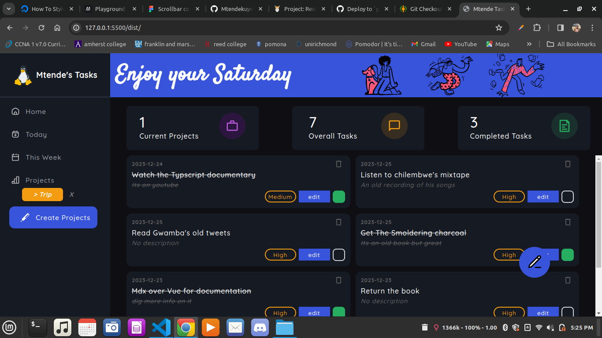
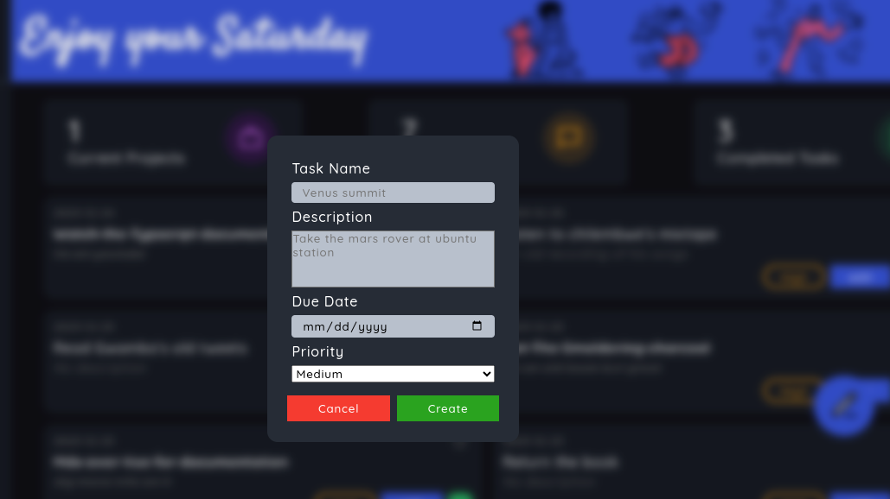
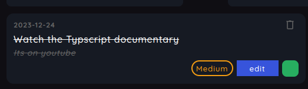
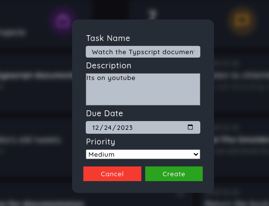
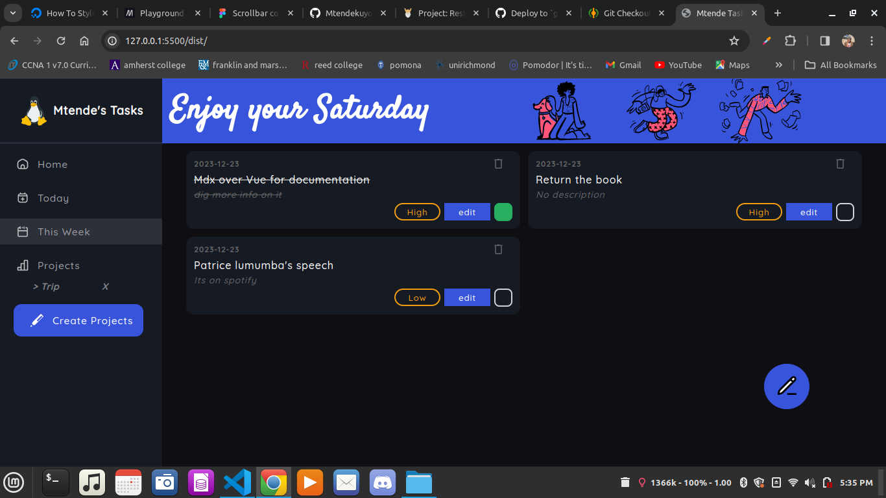
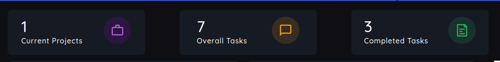
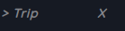

# Task Management System

        > *Screenshot of the Web application *
        

## Short Description 🎲

A task management system developed using vanilla JS and css. The development process involved use of npm and webpack as core technologies. This is a C.R.U.D app meaning a user can add a new task or project, read the task, change the task credentials and delete the task. A user can also do this with the projects

 ## Demo 🚴
-  click [Live Preview](https://mtendekuyokwa19.github.io/TaskManagementSystem/)to check it out!

#### Installation
1. clone the repo
- `git@github.com:Mtendekuyokwa19/TaskManagementSystem.git`
2. Installation of all the pckages
- `npx webpack`

3.
- `npm i html-webpack-plugin`

 ## Features and Aspects

1. Entering a new Task

         > *Screenshot of dialog entry box*

2. Deleting a Task

>A delete button at the edge of the  Task box
               
3. Setting Task status  
                                                  

> The status has been set to complete
4. Editing the Task

> a pop up similar to the one used when entering a new task comes up. The creditials of the Task you are trying to edit are auto-filed

5. Viewing Today's tasks & current week's task

> A section  which has this weeks tasks all together

6. Update of statistics of all your projects and Tasks

> when a task is added or removed the stats tab update themselves automatically
7. Deleting of tasks

> Both Tasks and projects can be deleted.Simply pressing the X you will clear all the tasks belonging to tht project

 ## Technologies and Tools 	🔧
 1. Webpack
 2. vanilla CSS
 3. Vanilla Javascript
 4. Chrome Dev tools
 5. Git
 6. Google fonts
 7. Figma And Figma community
 8. Github Pages
 9. npm
 

 ## What I learned 🎓
 - Modular programming.
 - Object-oriented Programming
 > Dissecting and applying the principles of OOP. The S.O.L.I.D principles, mostly single responsibility helped alot in the project

 ## Motivation 🧠
 - Creating a task management system for myself so that I can be using it for school.
 - Practicing Time management

 ## Credits 🤝

 - [Google Fonts](https://fonts.google.com/specimen/Quicksand?query=Quicksand).

 - [Figma Color palettes](https://www.figma.com/file/kVuVeHcwCENaBn4kKAxhGt/Dashboard---Dark-And-Light-Modes-%7C-Color-Variables-(Community)?type=design&node-id=7-1619&mode=design&t=ng4IU85pFsnxovSB-0)

## Future Update🔮
1. Notification when there are no tasks.
2. Charts and dates

